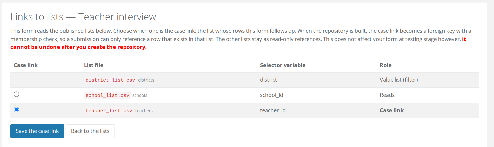

# Links and the case link

A form that selects from a [published list](published-lists.md) is **linked** to it. One of those links is special: the **case link** is the list whose rows the form is about. Setting it is what turns an ordinary ODK form into a follow-up form.

## Open the Links to lists page

Go to the form's page and click **Links to lists**. The button appears on a form that has no repository yet, in a project that publishes lists, so open it after uploading the form and [attaching its files](../../fundamentals/forms/form-files.md).

FormShare reads the form's `select_one_from_file` questions and shows every published list the form references, with the selector variable and the role of each:

| Role | Meaning |
| --- | --- |
| **Case link** | The list whose rows this form follows up. Exactly one. |
| **Reads** | A list the form selects from as a reference, such as the school used to filter the teachers. |
| **Value list (filter)** | A list of distinct values. It can never be the case link. |

<figure><figcaption><p>Only lists of cases get a radio button. The value list is marked with a dash, and the page repeats in red that the choice cannot be undone once the repository is built.</p></figcaption></figure>

When the form references exactly one list of cases, FormShare marks it as the case link for you. With several, choose with the radio buttons and click **Save the case link**.


**The question that picks the case must sit outside every repeat.** Only questions outside repeats are read on this page. A list referenced from inside a repeat is still served to the form, but no link is detected and nothing is enforced.


## The choice is fixed when the repository is built

While the form is in testing, the case link changes nothing about how the form behaves. It takes effect when you [create the repository](../../fundamentals/forms/#create-a-repository), and at that point it becomes part of the database.


**This cannot be undone after you create the repository.** The case link becomes a foreign key with a membership check in the form's database, and a later version of the form keeps the same link. If you picked the wrong list, the only way back is a new form.


## What the build writes into the database

Building the repository of a follow-up form with its lists attached turns each link into database structure. For the interview of the [walkthrough](walkthrough.md):

* The case-link selector (`teacher_id`) is stored as the identity of a row of the source table, with a foreign key to it. The source row cannot be deleted while follow-ups refer to it.
* A check runs on every incoming submission: the case must exist and be active, or the submission is refused and lands in the form's [error log](../cleaning/submissions-with-errors.md) with the message *Case ID … is inactive or does not exist*.
* A selector that only **reads** a list (`school_id`) is stored as an identity with a foreign key too, but without the membership check.
* A selector that reads a **value list** (`district`) holds the value itself, because a value list has no identity to point at.

A [new version](../../fundamentals/repositories/merging-subversions-of-a-form.md) of the form inherits the lists and the case link of the version it replaces. A version that picks its cases from a different list is refused at the merge check, naming the list the version must keep.

## What the case link stores

The selector variable of a follow-up holds the case's identity, a 36-character [rowuuid](how-cases-are-identified.md), not the code you see in the registration form. That has two practical consequences.

**To show something readable in the follow-up**, read the list with an `instance()` expression:

```
instance('<file name without .csv>')/root/item[name=current()/../<selector>]/<column>
```

**To carry a recognisable code into your exports**, either join the two repositories on the identity, or serve the code as a column of the list (`emis` in the walkthrough) and store it in the follow-up with a `calculate`.

## What's next

* See the links you built drawn out in the "[Workflow diagram](workflow-diagram.md)".
* Read "[Rules and safeguards](rules-and-safeguards.md)" for what happens when a case is missing, inactive, or deleted.
