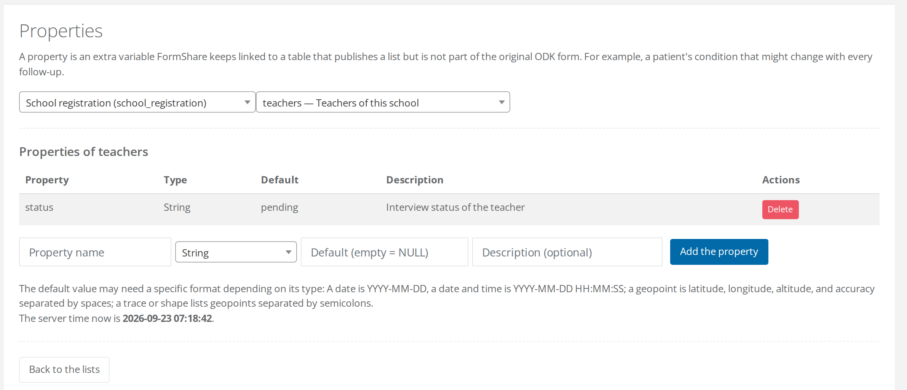

# Properties

A **property** is a typed column FormShare keeps beside a table that publishes a [list](published-lists.md), with one value per case. It lives in a side table (`<table>_properties`), it is born with a default, and it travels in the lists like any other column. Adding one does not touch the ODK form, so the case-creating form never has to be rewritten to carry a piece of state it was not designed for.

A school's `visit_round`, a teacher's `status`, a patient's `risk_level`: these belong to the case rather than to the submission that registered it.

## Add a property

On the **Published lists** page, click **Properties**. Two drop-downs pick a form and then one of its tables. Only the tables that publish a list are offered, because a property exists to be served in a list and maintained by follow-ups. The table drop-down names each one with the label it carries in the ODK form, so a repeat is easy to recognise.

<figure><figcaption>
The properties a table already has are listed above the row where you add the next one. The line at the bottom gives the server's current time, which is the clock a DateTime default is read against.
</figcaption></figure>

Fill the row below the table: a **name**, a **type**, a **default** and an optional **description**, then click **Add the property**.

The name is lower case, starts with a letter, and holds letters, digits and underscores. It cannot be the name of a column that already exists in the table.

| Type | Stored as | Default format |
| --- | --- | --- |
| String | text, up to 255 characters | any text |
| Integer | whole number | `0`, `12` |
| Decimal | number with 3 decimals | `0`, `12.5` |
| Date | date | `YYYY-MM-DD` |
| DateTime | date and time | `YYYY-MM-DD HH:MM:SS` |
| GeoPoint | point | `latitude longitude altitude accuracy`, separated by spaces |
| GeoTrace, GeoShape | line, polygon | geopoints separated by semicolons |

An empty default means NULL. FormShare checks the default against the type, so `AAA` is refused for an integer and `0` for a date, and it shows the server's current time beside the box when you pick DateTime.

## What happens when you add one

The column is created at once. Every existing case gets the default, every future case is born with it, and the change is audited like the rest of the schema.

To serve the property to devices, go to the edit page of the list and add it from the **Properties** group of the column drop-down. It then behaves like any other served column: you can give it a **Served as** name, filter on it with a `choice_filter`, and read it with an `instance()` expression.

## Delete a property

A property that a list serves cannot be deleted. Remove it from the list's served columns first, then delete the property, and the column goes with it.


**Today a property keeps its default value.** The *actions* feature that will let a follow-up submission write to a property, or deactivate the case, is still being built. Properties exist now so that the columns actions will write are already in your lists, and the forms you design today will not have to change when it arrives.


## What's next

* Serve the property in a list: "[Published lists](published-lists.md)".
* See where properties sit in the picture: "[Workflow diagram](workflow-diagram.md)".
