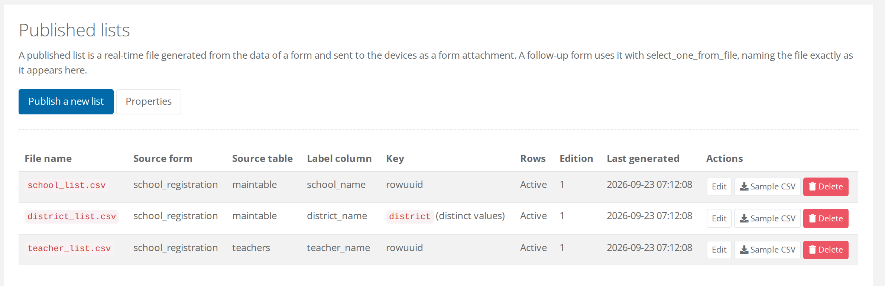
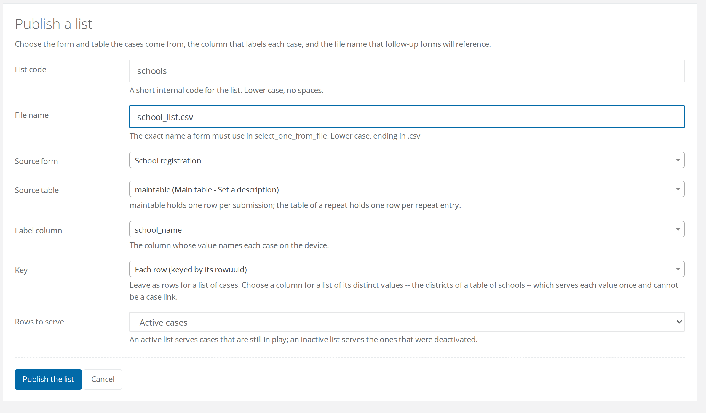

# Published lists

A **published list** is a CSV file FormShare generates from a table of a form's [repository](../../fundamentals/repositories/README.md) and serves to devices as an attachment of any form whose XLSForm names the file. It refreshes as data arrives, so the choices an enumerator sees in the field come from the data the team has collected.

## The Published lists page

Open a project and click **Published lists** in the right column, under the forms. The button appears once the project has a form with a repository.

The page lists every published list of the project:

| Column | Meaning |
| --- | --- |
| File name | The exact file name a form must use in `select_one_from_file`. |
| Source form, Source table | Where the rows come from. |
| Label column | The column shown to the enumerator as the option's text. |
| Key | `rowuuid` for a list of cases, one row per case; a column name marked *(distinct values)* for a [value list](#value-lists-and-cascades). |
| Rows | *Active* or *Inactive*: which cases the list serves. |
| Edition | How many times the list has been regenerated. |
| Last generated | When it was last generated, or *Never* if no device has asked for it yet. |

Each list has three actions. **Edit** opens its columns and settings. **Sample CSV** downloads ten rows, generated now, to design your forms against. **Delete** is offered only while no form with a repository uses the list.

Two buttons sit above the table: **Publish a new list**, and **[Properties](properties.md)** once the project has at least one list.

<figure><figcaption>
Two of these are lists of cases, keyed by <code>rowuuid</code>. The middle one is keyed by <code>district (distinct values)</code>, which marks it as a value list. <strong>Delete</strong> is offered on all three here because no form with a repository uses them yet.
</figcaption></figure>

## Publish a list

**Publish a new list** opens a short wizard:

| Field | What to enter |
| --- | --- |
| List code | A short internal code: lower case, no spaces. `schools`, `teachers`. |
| File name | Lower case, starting with a letter, ending in `.csv`: `school_list.csv`. |
| Source form | A form of this project that has a repository. |
| Source table | `maintable` for one row per submission, or the table of a repeat for one row per repeat entry. |
| Label column | The column whose value names each case on the device. |
| Key | Leave *Each row (keyed by its rowuuid)* for a list of cases. Choose a column for a list of its distinct values. |
| Rows to serve | *Active cases*, the default, or *Inactive cases*. |

<figure><figcaption>
Every field carries its own hint. The source table drop-down names each table with its description, which is how you tell <code>maintable</code>, one row per submission, from the table of a repeat.
</figcaption></figure>


**The file name is the contract.** A form references a list by naming its file in `select_one_from_file`, so the name is the whole coupling between the list and your forms. Choose it once, before anyone writes a form against it, and do not rename it afterwards.


**Publish the list** creates it and opens its edit page, where you choose the columns it carries.

## Choose the columns a list serves

Every list always carries two columns: `name`, the identity of the row, and `label`, the value of the label column. The edit page adds the rest.

* **Key**, **Rows to serve** and **Label** sit at the top, each with its own button, so a change to one is applied on its own. The key cannot change while a form with a repository uses the list, because that form's database was shaped by it.
* **Served columns** let you add a column of the source table, or a [property](properties.md) of it. Properties sit in their own group in the drop-down and carry a *property* tag once served. A **Served as** name is optional, and it is what your form's `choice_filter` and `instance()` expressions will see. `name` and `label` are taken, and no two served columns may share a name.
* **Remove** takes a column out again.

Every change on this page marks the served copies stale. Devices get the new shape at their next update check, without waiting for new data to arrive.

## Value lists and cascades

A list keyed by a column serves each distinct value of that column once, as `name`, with the label column as `label`. This is how you build a cascade from a single table: the districts of the schools, then the schools of a district.

* Choose the column under **Key** when publishing, or on the edit page later.
* The label column may be a different column, such as `district_name` beside `district`. Each distinct combination is served once, so keep the two in step: a code with two spellings of its label appears twice.
* A value list has no row identity. It can never be the [case link](case-links.md), its selector gets no foreign key, and the value itself is what gets stored.
* A form that reads only a value list is not a follow-up of anything.

Cascades across tables work through identities instead: serve a repeat table's `parent_rowuuid` beside the parent list's `name`, as `teacher_list.csv` does with `school_id` in the [walkthrough](walkthrough.md).

## How lists reach the devices

* **A list is an attachment.** Devices download it through the form's manifest like any media file. Stock ODK Collect, Enketo and FormShare Collect need nothing new.
* **Lists are generated on demand.** *Last generated: Never* means no device has asked yet. The first request for a form that attaches the list generates it. Each later request regenerates it if the source form received a submission or had its data edited since, or if the list's definition changed. A device that checks for updates gets the current rows; a device that does not keeps the rows it has.
* **Every regeneration advances the edition** and changes the file's hash, which is what makes the device report the form as updated.
* **Sample CSV runs the list now**, limited to ten rows, without touching the copies served to devices. Use it to design your forms, and as the placeholder to attach at upload.
* **`name` and `label` always come first**, then the served columns in the order of the edit page. Every field is quoted.
* **A list can be empty.** Before the first registration it holds only the header line. The form still opens, and the select shows nothing.

## What's next

* Tell FormShare which list a form follows up in "[Links and the case link](case-links.md)".
* Add columns without touching the ODK form with "[Properties](properties.md)".
* See what FormShare refuses to change once a list is in use in "[Rules and safeguards](rules-and-safeguards.md)".
