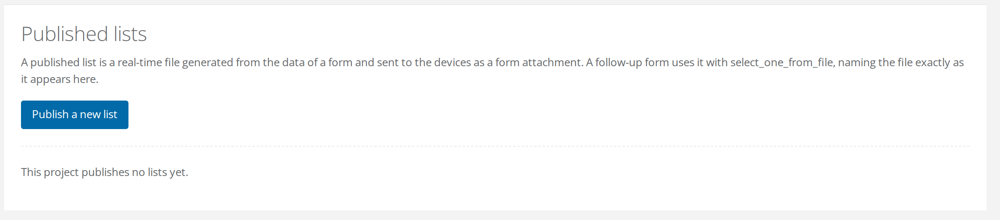
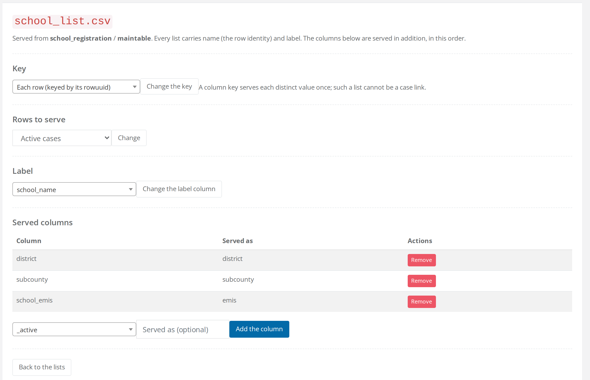
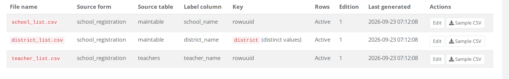

# Walkthrough: schools and teachers

This walkthrough builds a working workflow from nothing. A registration form records schools with the teachers who work in them, and an interview form comes back to interview one teacher. Three lists connect the two forms:

```
School registration ──publishes──► school_list.csv   (one row per school)
        │                          district_list.csv (the distinct districts)
        └── teachers (repeat) ───► teacher_list.csv  (one row per teacher)

Teacher interview ── reads district_list.csv, then school_list.csv filtered by district,
                     then teacher_list.csv filtered by school  ← the case link
```

## Download the example

Both workbooks are ready to upload. They were converted with pyxform and checked with FormShare's form checker, the same call an upload makes, before they were published here. Every sheet is also written out in the steps below, so you can build them by hand instead.


The form that creates the cases. One school per submission, its teachers in the repeat `teachers`, primary key `school_emis`. Used in step 1.



The form that follows a teacher up. Primary key `interview_key`, case link `teacher_list.csv`. Used in step 6.


The interview form names three CSV files it does not carry, so FormShare asks for them at upload. These three hold nothing but the header line of the list they stand for, which is all a placeholder needs. Attach them in step 6, or download the real thing with **Sample CSV** once the lists exist.


Placeholder for the value list of districts: key column `district`, label `district_name`.



Placeholder for the list of schools, serving `district`, `subcounty` and `school_emis` as `emis`.



Placeholder for the list of teachers from the repeat, serving `parent_rowuuid` as `school_id`, `role` and the property `status`.


Work through the steps in order: each one depends on the one before it.


**Do this in a test project first.** Step 9 builds a repository, and the case link it writes into the database [cannot be undone](case-links.md#the-choice-is-fixed-when-the-repository-is-built). A throwaway project costs you nothing and lets you see every screen before you commit to the real thing.




## Build and upload the form that creates cases

Use the **school\_registration.xlsx** from the top of this page, or build it yourself from these three sheets.

**survey**

| type | name | label | required | calculation |
| --- | --- | --- | --- | --- |
| start | start |  |  |  |
| end | end |  |  |  |
| text | school\_emis | EMIS code of the school | yes |  |
| text | school\_name | Name of the school | yes |  |
| select\_one district | district | District | yes |  |
| calculate | district\_name |  |  | `jr:choice-name(${district}, '${district}')` |
| text | subcounty | Sub-county | yes |  |
| text | head\_teacher | Name of the head teacher | yes |  |
| integer | pupils | Number of pupils enrolled | yes |  |
| geopoint | location | Location of the school |  |  |
| begin\_repeat | teachers | Teachers of this school |  |  |
| text | teacher\_name | Name of the teacher | yes |  |
| select\_one role | role | Main role | yes |  |
| select\_one yes\_no | present\_today | Is the teacher present today? | yes |  |
| end\_repeat |  |  |  |  |

**choices**

| list\_name | name | label |
| --- | --- | --- |
| district | kampala | Kampala |
| district | wakiso | Wakiso |
| district | mukono | Mukono |
| role | head\_teacher | Head teacher |
| role | teacher | Teacher |
| role | caregiver | Caregiver |
| yes\_no | yes | Yes |
| yes\_no | no | No |

**settings**

| form\_title | form\_id | version |
| --- | --- | --- |
| School registration | school\_registration | 1 |

Two things in this form are there for the sake of the lists:

* `district_name` stores the district's label beside its code, so that a list of districts can show *Wakiso* while filtering on `wakiso`.
* The repeat is called `teachers`. Its table in the repository is called `teachers` too, and that table is where the teacher list will come from.

Upload the form to your project with **Add new form**, as you would any other form. When FormShare asks which variable controls duplicate submissions, answer `school_emis`: it becomes the form's primary key, and FormShare will refuse a second registration of the same school.

[Assign your assistants](../../guides/creating-your-first-task/create-and-assign-assistants.md), [test the form](../../guides/creating-your-first-task/test-your-form.md), and then [create the repository](../../fundamentals/forms/#create-a-repository). Collect two or three registrations, or enter them yourself, so the lists have something to show.



## Publish the list of schools

Open the project page and click **Published lists**. A project that has published nothing yet says so, and offers one button.

<figure><figcaption><p><strong>Properties</strong> is not on the page yet. It appears beside <strong>Publish a new list</strong> once the project has at least one list to attach a property to.</p></figcaption></figure>

Click **Publish a new list** and fill the wizard in:

| Field | Value |
| --- | --- |
| List code | `schools` |
| File name | `school_list.csv` |
| Source form | School registration |
| Source table | `maintable` |
| Label column | `school_name` |
| Key | Each row (keyed by its rowuuid) |
| Rows to serve | Active cases |

Click **Publish the list**. The list's edit page opens. Pick each column from the drop-down at the bottom, type a **Served as** name where the table asks for one, and click **Add the column**:

| Column | Served as |
| --- | --- |
| `district` | *(leave empty)* |
| `subcounty` | *(leave empty)* |
| `school_emis` | `emis` |

<figure><figcaption><p>Leaving <strong>Served as</strong> empty keeps the column's own name, which is why <code>district</code> and <code>subcounty</code> read the same on both sides while <code>school_emis</code> is served as <code>emis</code>.</p></figcaption></figure>

The line under the file name says where the rows come from, and the key, the rows to serve and the label column each have their own button, so you can come back and change any of them later.

**Sample CSV** now downloads something like this:

```csv
"name","label","district","subcounty","emis"
"5c1d9a7e-3b2f-4c8a-9e1d-2f3a4b5c6d7e","Kira Primary School","wakiso","Kira","U0012345"
"9e8d7c6b-5a4f-4e3d-8c2b-1a0f9e8d7c6b","Nakasero Primary School","kampala","Central","U0098765"
```

`name` is the row's identity, its [rowuuid](how-cases-are-identified.md), and that is the value the follow-up form will store. `label` is the school's name. The rest are the columns you served, under the names you gave them.



## Publish the list of districts

The interview will ask for a district before it asks for a school, so that the enumerator picks from a short list instead of every school in the country. That needs a second list from the same table, keyed by a column instead of by the row:

| Field | Value |
| --- | --- |
| List code | `districts` |
| File name | `district_list.csv` |
| Source form | School registration |
| Source table | `maintable` |
| Label column | `district_name` |
| Key | `district` |

This serves each district once, with `name` holding the code (`wakiso`) and `label` the name (*Wakiso*). There is no `rowuuid` in it, because it is a [value list](published-lists.md#value-lists-and-cascades) rather than a list of cases. No extra columns are needed.



## Publish the list of teachers

The cases the interview is really about are the rows of the repeat, so this list comes from the `teachers` table:

| Field | Value |
| --- | --- |
| List code | `teachers` |
| File name | `teacher_list.csv` |
| Source form | School registration |
| Source table | `teachers` |
| Label column | `teacher_name` |
| Key | Each row (keyed by its rowuuid) |

Served columns:

| Column | Served as |
| --- | --- |
| `parent_rowuuid` | `school_id` |
| `role` | *(leave empty)* |

`parent_rowuuid` is the identity of the school row a teacher belongs to, the same value `school_list.csv` serves as `name`. Serving it as `school_id` is what will let the interview show only the teachers of the school just picked. Every repeat table has it, along with `root_rowuuid`, the identity of the submission the row belongs to.



## Add a property to the teachers (optional)

A [property](properties.md) is a column FormShare keeps beside a table without changing your ODK form. Click **Properties** on the Published lists page, choose the form *School registration* and the table `teachers`, and add:

| Property name | Type | Default | Description |
| --- | --- | --- | --- |
| `status` | String | `pending` | Interview status of the teacher |

Every teacher now has `status = pending`, whether registered before or after you added it. Go back to the edit page of `teacher_list.csv` and add the column `status` from the **Properties** group of the drop-down. The list serves it too.

Today the value stays at its default. The *actions* feature that will let a follow-up change it is still being built, so serve the property now and the form you design today will not have to change when it arrives.



## Build the follow-up form

Use the **teacher\_interview.xlsx** from the top of this page, or build it yourself.

**survey**

| type | name | label | required | appearance | choice\_filter | calculation |
| --- | --- | --- | --- | --- | --- | --- |
| start | start |  |  |  |  |  |
| end | end |  |  |  |  |  |
| select\_one\_from\_file district\_list.csv | district | District | yes |  |  |  |
| select\_one\_from\_file school\_list.csv | school\_id | School | yes | autocomplete | `district=${district}` |  |
| calculate | school\_name |  |  |  |  | `instance('school_list')/root/item[name=current()/../school_id]/label` |
| select\_one\_from\_file teacher\_list.csv | teacher\_id | Teacher | yes |  | `school_id=${school_id}` |  |
| calculate | teacher\_name |  |  |  |  | `instance('teacher_list')/root/item[name=current()/../teacher_id]/label` |
| note | who | Interviewing ${teacher\_name} of ${school\_name} |  |  |  |  |
| calculate | interview\_key |  |  |  |  | `concat(${teacher_id}, '-', format-date(today(), '%Y%m%d'))` |
| date | interview\_date | Date of the interview | yes |  |  |  |
| select\_one yes\_no | trained | Has the teacher received early childhood training? | yes |  |  |  |
| integer | years\_experience | Years of experience | yes |  |  |  |
| select\_one yes\_no | still\_working | Is the teacher still working at this school? | yes |  |  |  |

**choices**

| list\_name | name | label |
| --- | --- | --- |
| yes\_no | yes | Yes |
| yes\_no | no | No |

**settings**

| form\_title | form\_id | version |
| --- | --- | --- |
| Teacher interview | teacher\_interview | 1 |

How the three selects work together:

1. `district` offers the districts that exist in the registrations collected so far.
2. `school_id` offers the schools, filtered by `district=${district}`, `district` being a column `school_list.csv` serves. The value stored is the school's `name`, its identity.
3. `teacher_id` offers the teachers whose `school_id` equals the school just chosen. The value stored is the teacher's identity, and this is the case link: the interview belongs to that teacher.
4. `instance('school_list')/root/item[name=current()/../school_id]/label` reads a column of the list for the row the enumerator picked. The instance name is the file name without `.csv`, and any served column can be read this way. Here it gives the note something readable to show.
5. `interview_key` is the form's primary key: one interview per teacher per day.

Upload the form and answer `interview_key` to the duplicate-submissions question. FormShare reports three missing files under [Form files](../../fundamentals/forms/form-files.md). Attach a CSV for each name: either the **Sample CSV** downloads from steps 2 to 4, or the three placeholders from the top of this page, which hold nothing but these header lines:


```csv
name,label
```



```csv
name,label,district,subcounty,emis
```



```csv
name,label,school_id,role,status
```


Whatever you attach is a placeholder. FormShare replaces its content with the generated list every time a device asks for the form, so what matters is the file name.



## Set the case link

Open the interview's form page and click **Links to lists**. FormShare has read the form's `select_one_from_file` questions and lists all three files it references, each with the variable that selects from it and the role FormShare reads from the form.

<figure><figcaption><p><code>district_list.csv</code> gets a dash instead of a radio button, because a value list can never be the case link. The grey word beside each file name is the list code you typed when you published it.</p></figcaption></figure>

Select `teacher_list.csv` and click **Save the case link**. The interview is now a follow-up of a teacher. When the repository is built, `teacher_id` will be checked against the teachers that exist and are active, and each interview will keep its school's identity in `school_id`.

FormShare marks the case link for you when a form references exactly one list of cases. Here there are two lists of cases, the schools and the teachers, so the choice is yours to make.



## Test on a device

Assign the interview form to your assistants and open it in ODK Collect or in [Enketo](../../additional-functionality/enketo.md). The three lists arrive as attachments of the form, generated from the registrations collected so far.

Register another school, then run *Get Blank Form* again. The device reports the form as updated, and the new school is in the picker.

Back on **Published lists**, the three lists now carry an edition and a *Last generated* time.

<figure><figcaption><p>One device request generated all three, so they share a timestamp and sit at edition 1. Collect another registration and fetch the form again, and each of them moves to edition 2.</p></figcaption></figure>

Lists are generated when a device asks for a form that attaches them, and regenerated when the source form has received a submission, or had its data edited, since the last generation.



## Create the interview's repository

When the interview form is ready, [create its repository](../../fundamentals/forms/#create-a-repository) as you would for any form. Building it with the lists attached turns the links into database structure:

* `teacher_id` is stored as the identity of a row of `teachers`, with a foreign key to it. A teacher row cannot be deleted while interviews refer to it.
* A check runs on every incoming interview: the teacher must exist and be active, or the submission is refused.
* `school_id` is stored as the identity of a row of `maintable` of the registration, with a foreign key too, but no membership check.
* `district` holds the district code, because a value list has no identity to point at.

The **Workflow diagram** button appears on the project page. Open it to see what you built.

What the enumerator sees does not change. What changes is what happens to a submission whose teacher is unknown to the server, because the registration was deleted or the teacher was deactivated: the submission is refused with the message *Case ID … is inactive or does not exist*, and it lands in the form's [error log](../cleaning/submissions-with-errors.md), where you can see it and decide what to do.



## Later: a new version of the interview

Upload the new workbook with **Merge new version** on the form page, attach the same three CSV names, and merge. The new version inherits the lists and the case link of the version it replaces.

A version that picks its cases from a different list is refused at the [merge check](../../fundamentals/repositories/merging-subversions-of-a-form.md), with the reason given. The same applies to a new version of the registration form: the lists it feeds keep working, and if it gains a column you can serve it after the merge.



## What's next

* Read "[Published lists](published-lists.md)" for the rest of the publishing screen: changing a list, value lists, and how lists reach the devices.
* Read "[Rules and safeguards](rules-and-safeguards.md)" before you start deleting forms, lists or cases.
* Open "[Workflow diagram](workflow-diagram.md)" to read the drawing of what you just built.
