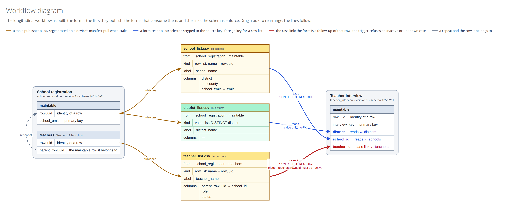

# Workflow diagram

The **workflow diagram** draws what you built: each form with its tables, each published list, and the relationships the databases enforce. It is generated from the project itself, so it shows what is true today rather than what anyone intended.

Open a project and click **Workflow diagram** in the right column. The button appears once a workflow is in place, which means a form with a repository attaches a list of the project.

<figure><figcaption>
The workflow built in the walkthrough, drawn by FormShare from the two repositories and the three lists between them.
</figcaption></figure>

## What the boxes show

**A form** is a box titled with the form's name, and under it the form ID, the version, and the schema holding its repository. Its tables sit inside, one block each, a repeat carrying the label it has in the ODK form. The rows name the columns that matter to the workflow: `rowuuid` as the identity of a row, the primary key, and in a repeat the `parent_rowuuid` that ties it to the row it belongs to.

**A list** is a card titled with its file name and its list code, holding four rows:

| Row | What it says |
| --- | --- |
| from | The form and table the rows come from. |
| kind | `row list: name = rowuuid` for a list of cases, or `value list: DISTINCT <column>` for a [value list](published-lists.md#value-lists-and-cascades). |
| label | The column the enumerator reads. |
| columns | The served columns, showing `source → served as` where you renamed one, and a dash where there are none. |

**A form that consumes lists** has its selectors picked out in colour, each one saying what it points at: `reads ← schools` for a reference, `case link ← teachers` for the [case link](case-links.md).

## What the lines show

| Colour | What it means |
| --- | --- |
| Brown | A table publishes a list, regenerated on a device's manifest pull when stale. |
| Blue | A form reads a list. The selector is retyped to the source key, with a foreign key when the list is a list of rows. |
| Red | The [case link](case-links.md). The label spells out the trigger, such as `teachers.rowuuid must be _active`. |
| Grey | A repeat and the row it belongs to. |

The blue and red lines also name what the database does on a delete, `FK ON DELETE RESTRICT` being what stops a case disappearing under its follow-ups. A blue line into a value list says `value only, no FK` instead, because there is no row for it to point at.

Boxes can be dragged and the lines follow, which helps when a project has enough forms to tangle.

## The model behind it

The same model is available as JSON at `/workflow/model` under the project's address, for anything else that wants to draw it or check it.

## What's next

* Go back to "[Links and the case link](case-links.md)" for what each line was built from.
* Read "[Rules and safeguards](rules-and-safeguards.md)" for what those relationships refuse to let you do.
